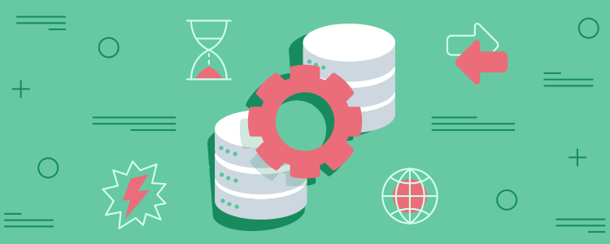

# API

O projeto desta semana é uma atividade onde devemos aplicar o conhecimento apreendido nas duas últimas semanas do curso de backend da {reprograma}: 

* API-Rest, Método HTTP - Get.

Para este projeto, devemos criar uma pasta _source_ (src), contendo o esqueleto de nossa API. Aprendemos o modelo de arquitetura MVC (_model, views, controller_), porém faremos uma versão adaptada, criando as seguintes pastas: _model, controller_ e _routes_. Além disto, os arquivos _app.js_ e _server.js_.

Neste exercício faremos manualmente nosso arquivo.json, com um tema de nossa escolha: eu optei pelo tema séries!

----

Para mais informações: https://github.com/reprograma/on7-porto-s8-projeto-pratico
